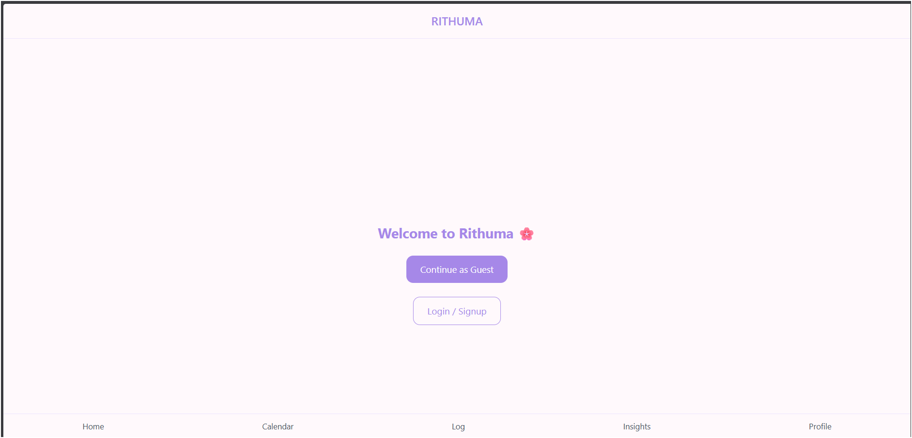
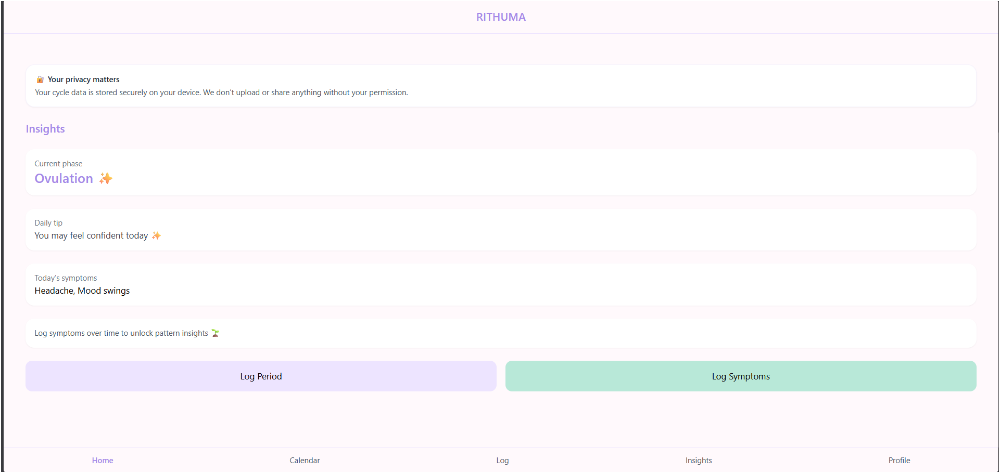
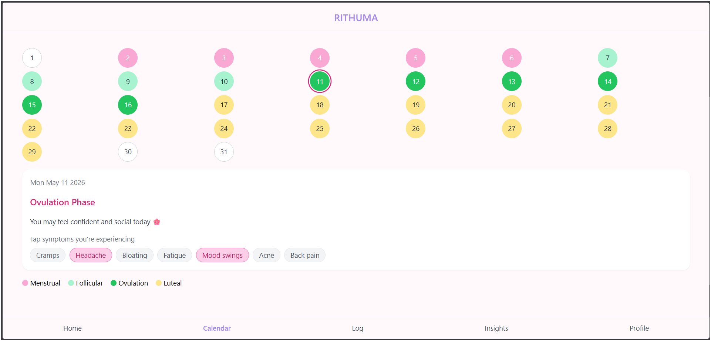
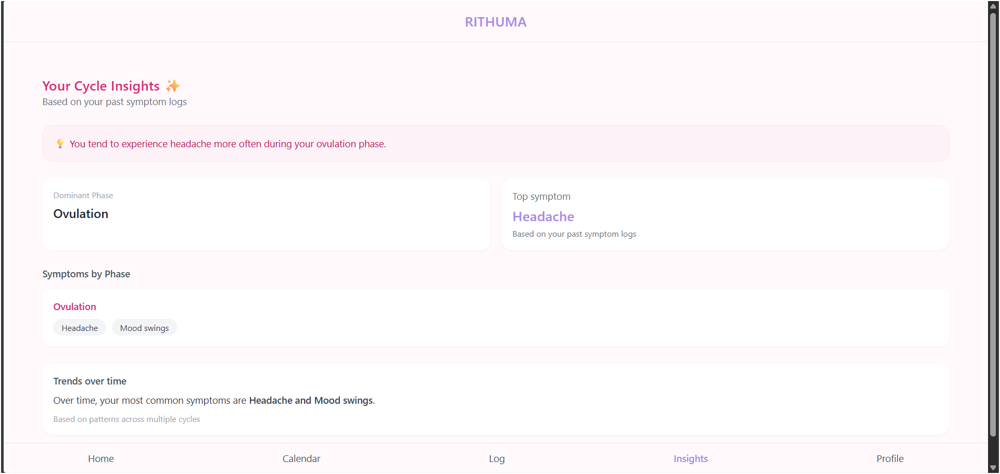
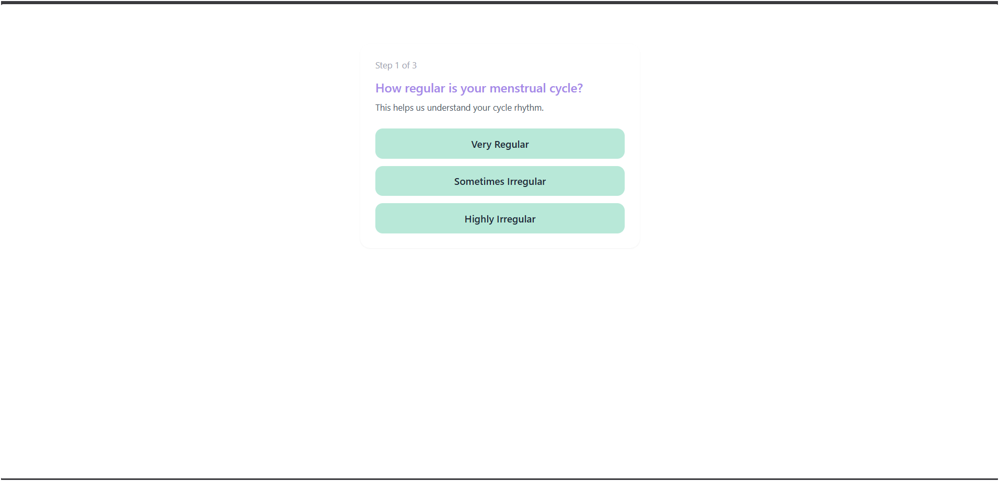
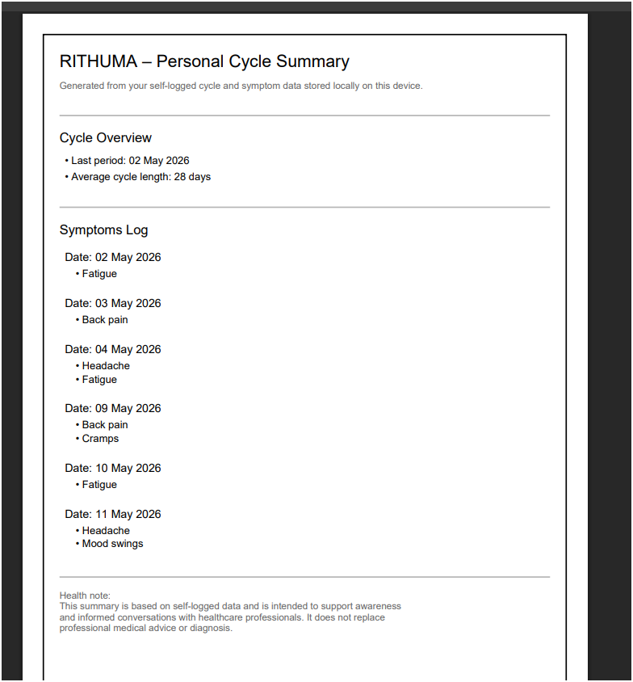
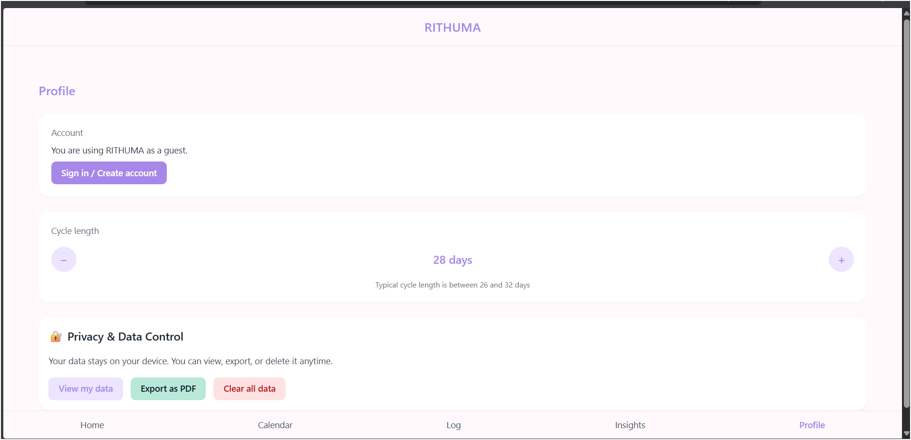

# 🌸 Rithuma — Privacy-First Cycle Tracking App

Rithuma is a modern, privacy-first women's health tracking application designed with a local-first architecture, encrypted storage, and predictive insights.

---

## 🚀 Features

- 📅 Cycle tracking & phase detection
- 🧠 Symptom logging & pattern analysis
- 🔒 Client-side encryption (privacy-first)
- 👤 Guest & authenticated user support
- ☁️ Cloud sync-ready architecture
- 📊 Insights engine (phase-based trends)
- 📄 Export data as PDF (doctor-friendly)

---

## 📸 Screenshots

### Authentication Choice


### Dashboard


### Calendar Tracking


### Insights Engine


### Onboarding Flow


### PDF Export


### Profile & Privacy Controls


## 🧠 Architecture Highlights

- Local-first data model (no data loss)
- Scoped storage (guest vs authenticated users)
- Modular storage service abstraction
- Encryption layer using CryptoJS
- Migration-safe storage design
- Sync-ready cloud integration layer

---

## 🛠 Tech Stack

- React (Vite)
- Tailwind CSS
- LocalStorage + Encryption
- Cloud Sync Layer (custom)
- jsPDF

---

## ⚙️ Local Setup

Clone the repository:

```bash
git clone https://github.com/VeereshMK-07/rithuma.git
```

Install dependencies:

```bash
npm install
```

Run the development server:

```bash
npm run dev
```

Open:

```bash
http://localhost:5173
```

## 📌 Current Status

✅ Phase 1 Complete (Core System + Sync Foundation)

Next:
- Full authentication system
- Advanced sync conflict resolution
- AI-based health insights
- Reports & analytics

---

## 🧪 Future Vision

Rithuma aims to become a smart, privacy-first health assistant with predictive analytics and clinical insights.

---

## 🔐 Privacy & Security

- All sensitive cycle data is stored locally on the user's device
- Client-side encryption protects stored health information
- Guest and authenticated data are isolated safely
- No health data is shared without user action
- Architecture is designed for secure cloud-sync expansion

## ⚠️ Disclaimer

This app is not a medical diagnosis tool. It is designed for awareness and tracking purposes only.
